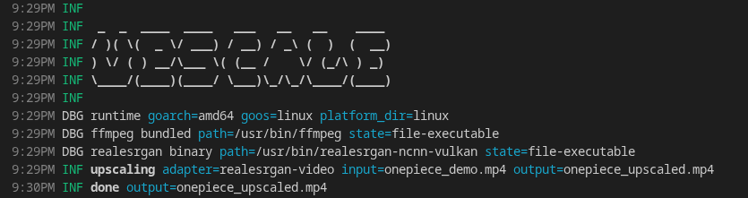

# upscale

Upscale images and videos with a fast and easy to use cross-platform CLI built around proven open-source models.

`upscale` gives you a simple command surface for common enhancement workflows, whether you are restoring old footage, improving video content, or preparing visuals for higher-resolution displays.



## Highlights

- One CLI toolkit for both image and video upscaling
- Multiple engines for different content styles
- Hardware acceleration for Intel, AMD and Nvidia GPUs
- Advanced Anime4K shader combining to achieve the best results
- Fully offline and self-hosted
- Cross-platform

## Current implementations

| Model | Best for | Typical use | Performance |
| --- | --- | --- | --- |
| `realesrgan` | General image enhancement | Photos, scans, digital art | Good[^1] |
| `realesrgan-video` | General video upscaling | Mixed live-action and animation | Good[^1] |
| `swinir` | High-detail image restoration | Quality-focused still images | Heavy[^1] |
| `anime4k-video` | Anime and line art animation | Sharp edges, clean stylized content | Best |

[^1]: Assumes a relatively modern GPU

## Installation

### Arch Linux
```
yay -S upscale
```

### Binaries (Windows, MacOS, Linux)
Download pre-made binaries for Windows, MacOS and Linux from [releases](http://github.com/SocketByte/upscale/releases).

### Build from source (Linux)

Requirements:

- Go
- ffmpeg
- realesrgan-ncnn-vulkan
- Python 3.10+

Build:

```bash
go build -o upscale .
```
Setup Python and SwinIR environment:
```
./install.sh
```

## Quick Start

General command shape:

```bash
upscale <image|video> -i <input> -o <output> [options]
```

### Image example

```bash
upscale image -i input.jpg -o output.png -a realesrgan -m normal -s 4 -q 3
```

### Video example

```bash
upscale video -i input.mp4 -o output.mp4 -a anime4k-video -s 4 -q 4 -p '{"encoder": "av1"}'
```

## Common Options

- `-a`: Select engine/adapter
- `-s`: Upscale factor
- `-q`: Quality preset (`1` low, `2` medium, `3` high, `4` ultra)
- `-m`: Content style (`normal` or `anime`)
- `-p`: JSON for engine-specific tuning
- `-r`: Raw progress output (useful for wrappers and scripts)

Run help for all options:

```bash
upscale image -h
upscale video -h
```